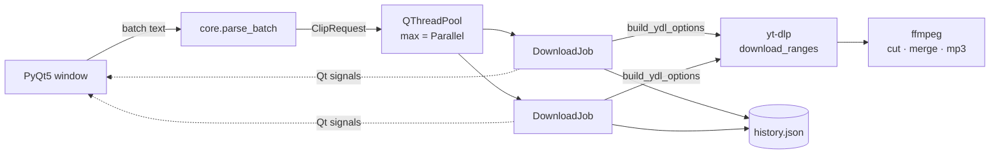

<div align="center">

# 🎬 Smart Clip Downloader

**Download exactly the part of a YouTube video you need — not the whole thing.**

Paste a link, set a start and end time, pick a quality, and get a frame-accurate MP4 clip (or an MP3). Queue dozens of clips and download several at once.

[](https://github.com/ChetanGadhiya017/Youtube-Clip-Downloader/actions/workflows/ci.yml)


</div>

---

## ✨ Features

- ✂️ **Clip by time range** — `SS`, `MM:SS` or `HH:MM:SS`; only that section is fetched and cut on exact frames.
- 📋 **Batch queue** — one job per line: `URL`, `URL START END` or `URL START-END`. Invalid lines are reported, valid ones still run.
- ⚡ **Parallel downloads** — choose how many jobs run at once (1–5).
- 🎚️ **Quality presets** — best, 144p → 8K (falls back to the nearest available resolution) or MP3 at 64–320 kbps.
- 📊 **Live progress** — per-job progress bar, speed and ETA.
- ⏹️ **Cancel** all running and queued jobs.
- 🕘 **History tab** — every download with title, range, quality and result.
- 💾 **Remembers** your folder, quality and parallel setting.
- 🏷️ **No overwrites** — clip files are named `Title [00.01.30-00.02.45].mp4`.

---

## 🚀 Installation

### 1. Prerequisites

| Requirement | Why | Install |
|---|---|---|
| Python 3.9+ | runs the app | [python.org](https://www.python.org/downloads/) |
| **ffmpeg** | cutting clips, merging audio/video, MP3 conversion | Windows: `winget install Gyan.FFmpeg` · macOS: `brew install ffmpeg` · Linux: `sudo apt install ffmpeg` |

The app warns you on start-up if ffmpeg is missing.

### 2. Get the app

```bash
git clone https://github.com/ChetanGadhiya017/Youtube-Clip-Downloader.git
cd Youtube-Clip-Downloader
python -m venv .venv
# Windows: .venv\Scripts\activate     macOS/Linux: source .venv/bin/activate
pip install -r requirements.txt
```

### 3. Run

```bash
python -m smart_clip_downloader
```

On Windows you can also just **double-click `SmartClipDownloader.pyw`** (no console window). Or install it as a command:

```bash
pip install .
smart-clip-downloader
```

> 💡 YouTube changes often. If downloads start failing, update the engine: `pip install -U yt-dlp`.

---

## 🧭 Usage

1. Paste a URL, optionally enter **Start** / **End** (leave both blank for the full video) and click **Add to batch**.
   Or type/paste lines straight into the batch box:
   ```
   https://youtu.be/abc123 0:30 1:15
   https://youtu.be/xyz789 1:02:00-1:03:30
   https://youtu.be/full_video
   ```
2. Pick **Quality**, **Save to** folder and **Parallel** count.
3. Click **Start downloads** and watch the queue. **Cancel all** stops everything.

---

## 🏗 How it works



| Module | Responsibility |
|---|---|
| `core.py` | Time parsing, validation, batch parsing, quality → format mapping, yt-dlp options. No GUI code → fully unit-tested. |
| `gui.py` | Window, queue table, worker pool. Workers talk to the UI only through Qt signals (thread-safe). |
| `history.py` | JSON history in your app-data folder. |

---

## 🧪 Development

```bash
pip install -r requirements.txt pytest ruff
pytest -q        # 21 tests
ruff check .
```

CI runs lint and tests on Windows and Ubuntu for Python 3.10 and 3.12.

```
Youtube-Clip-Downloader
├── smart_clip_downloader/
│   ├── core.py          # pure logic
│   ├── gui.py           # PyQt5 UI
│   ├── history.py       # download history
│   └── assets/icons/
├── tests/
├── SmartClipDownloader.pyw   # double-click launcher
├── pyproject.toml
└── requirements.txt
```

---

## 🗺 Roadmap

- [ ] Pause / resume for full-video downloads
- [ ] Playlist support with per-video ranges
- [ ] Subtitle download and burn-in
- [ ] Standalone Windows `.exe` via PyInstaller

---

## ⚖️ Disclaimer

For personal and educational use. Only download content you own or have permission to download, and respect YouTube's Terms of Service and copyright law.

## 📄 License

[MIT](LICENSE) © Chetan Gadhiya
