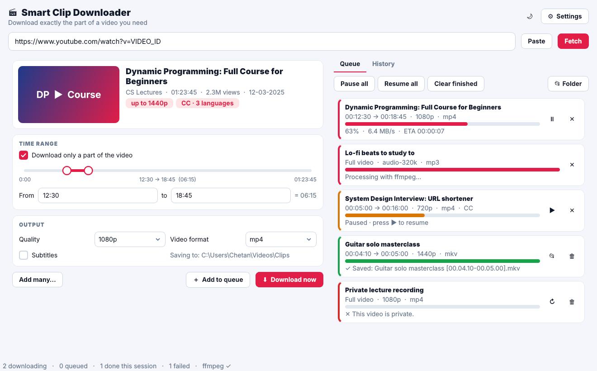
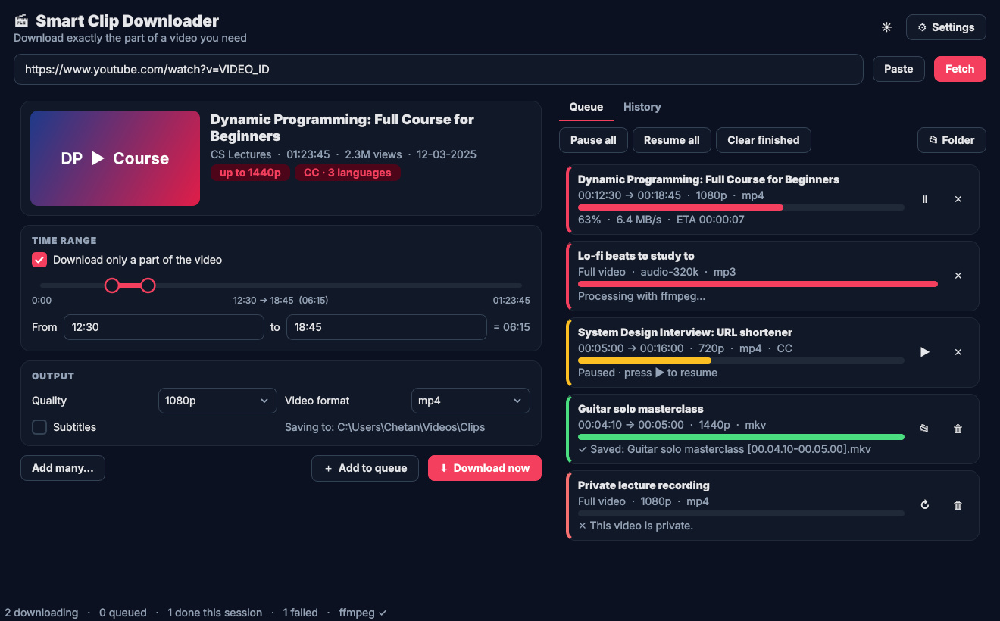
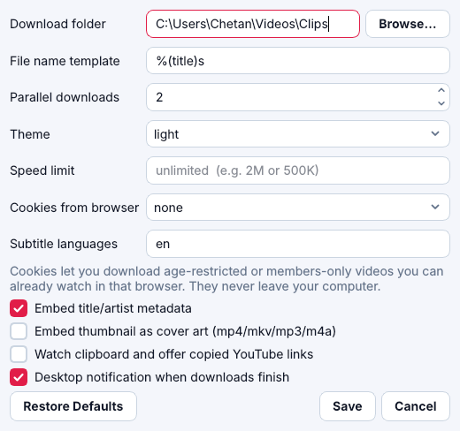
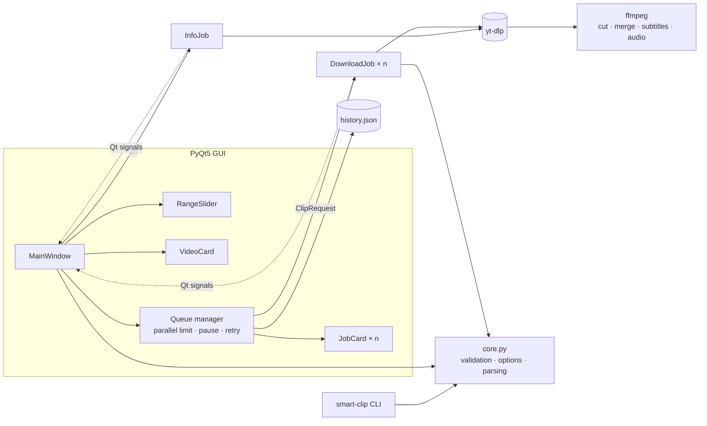

<div align="center">

# 🎬 Smart Clip Downloader

**Download exactly the part of a YouTube video you need, not the whole thing.**

Paste a link, drag the range handles, press Download. You get a frame-accurate MP4/MKV clip or an MP3/M4A/Opus track, with subtitles if you want them. Queue as many as you like; they download in parallel.

[](https://github.com/ChetanGadhiya017/Youtube-Clip-Downloader/actions/workflows/ci.yml)
[](https://github.com/ChetanGadhiya017/Youtube-Clip-Downloader/releases)




</div>

---

## ✨ Features

**Clip precisely**
- 🔎 **Fetch** shows a preview: thumbnail, channel, length, views, best available quality and subtitle languages
- 🎚️ **Range slider**: drag two handles or type `SS`, `MM:SS` or `HH:MM:SS`. Invalid ranges are flagged before you start
- ✂️ **Frame-accurate cuts**: only the selected section is downloaded and cut by ffmpeg

**Choose the output**
- 🎞️ Quality from 144p to 8K (only the qualities that video actually has), or audio at 64–320 kbps
- 📦 Video as **MP4 / MKV / WebM**, audio as **MP3 / M4A / Opus / WAV / FLAC**
- 💬 **Subtitles** (manual or auto-generated, any languages) embedded into the video
- 🏷️ Title/artist **metadata** and **cover art** embedding, custom **file-name templates**

**Work through a queue**
- ⚡ **Parallel downloads** (1–5) with live progress, speed and ETA for every job
- ⏸️ **Pause / resume** (full videos continue from where they stopped), cancel, retry, show in folder
- 📋 **Playlists**: add every video in one click. **Batch dialog**: paste many `URL START END` lines
- 🖱️ **Drag & drop** links onto the window, or turn on **clipboard watching**
- 🕘 **History** with search, *open file* and *Download again*
- 🔔 Desktop **notification** when the queue finishes

**Polish**
- 🌗 Light & dark themes (follows your system), keyboard shortcuts: `Ctrl+L` URL bar · `Ctrl+Enter` add · `Ctrl+,` settings
- 🐢 Speed limit, 🍪 cookies from your browser for age-restricted videos you can already watch
- 🧑‍💻 A **command-line** version for scripts

<table>
<tr>
<td width="62%"></td>
<td width="38%"></td>
</tr>
</table>

---

## 🚀 Installation

### Option A: Windows app (no Python needed)

1. Download **`SmartClipDownloader-windows.zip`** from [Releases](https://github.com/ChetanGadhiya017/Youtube-Clip-Downloader/releases), unzip it and run `SmartClipDownloader.exe`.
2. Install **ffmpeg** once: `winget install Gyan.FFmpeg`, then restart the app.

### Option B: from source (Windows, macOS, Linux)

| Requirement | Install |
|---|---|
| Python 3.9+ | [python.org](https://www.python.org/downloads/) |
| **ffmpeg** (cutting, merging HD video, converting audio) | Windows `winget install Gyan.FFmpeg` · macOS `brew install ffmpeg` · Linux `sudo apt install ffmpeg` |

```bash
git clone https://github.com/ChetanGadhiya017/Youtube-Clip-Downloader.git
cd Youtube-Clip-Downloader
python -m venv .venv
# Windows: .venv\Scripts\activate     macOS/Linux: source .venv/bin/activate
pip install -r requirements.txt
python -m smart_clip_downloader          # or double-click SmartClipDownloader.pyw on Windows
```

Or install it as commands: `pip install .` gives you `smart-clip-downloader` (GUI) and `smart-clip` (CLI).

> 💡 YouTube changes often. If downloads start failing, update the engine with `pip install -U yt-dlp`.

---

## 🧑‍💻 Command line

```bash
smart-clip "https://youtu.be/VIDEO" --start 1:30 --end 2:45 -q 1080p
smart-clip "https://youtu.be/VIDEO" -q audio-320k --audio-format m4a -o ~/Music
smart-clip "https://youtu.be/VIDEO" --subs en,hi -f mkv
smart-clip --batch jobs.txt -o ~/Clips          # one "URL [START END]" per line
smart-clip "https://youtu.be/VIDEO" --info      # title, length, qualities, subtitles
```

---

## 🏗 Architecture



| Module | Responsibility |
|---|---|
| `core.py` | Pure logic: time parsing, `ClipRequest` validation, yt-dlp options (ranges, formats, subtitles, metadata, rate limit, cookies), playlist/info parsing. No Qt, fully unit-tested. |
| `workers.py` | `InfoJob`, `ThumbJob`, `DownloadJob` (`QRunnable`s). Pause/cancel via events; user-friendly error messages |
| `gui.py` | Main window and queue manager |
| `widgets.py` | `RangeSlider`, `VideoCard`, `JobCard` |
| `settings.py` / `theme.py` | Preferences + dialog, light/dark style sheets |
| `cli.py` | `smart-clip` command |

---

## 🧪 Development

```bash
pip install -r requirements.txt pytest pytest-qt ruff
ruff check .
pytest -q                     # 43 tests: core, CLI, history and headless GUI (fake downloader)
pyinstaller SmartClipDownloader.spec    # build the desktop app into dist/
```

CI runs lint and tests on **Windows and Ubuntu** (Python 3.10 & 3.12). Pushing a `v*` tag builds the Windows app and publishes a GitHub Release.

---

## ⚖️ Disclaimer

For personal and educational use. Only download content you own or have permission to download, and respect YouTube's Terms of Service and copyright law.

## 📄 License

[MIT](LICENSE) © Chetan Gadhiya
